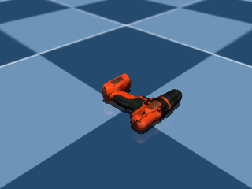

# Mujoco-YCB-Dataset
Tools to download models from the [YCB dataset](https://www.ycbbenchmarks.com/) and use them with the MuJoCo simulator.

You can either follow the instructions provided below, or directly download the converted mjcf files of YCB objects from [this url](https://www.dropbox.com/scl/fi/bck4zde85zearuyw7s5yn/ycb_mujoco.tar.gz?rlkey=u5f43jhsmjq7hxj93uih1lduk&st=0zfd7rp0&dl=0).



## Setup

```
pip install mujoco
pip install obj2mjcf==0.0.8
pip install mediapy
```

## Downloading YCB objects

```
python scripts/ycb_downloader.py
```

You can configure a few options in the script, including choosing which objects and model types to download. However, the default options will get all of the YCB object models and may take a few minutes to download.

## Using YCB Object Models in MuJoCo

After you have downloaded the YCB models, you can run the following jupyer-notebook files.

1. Convert YCB datasets to MJCF format: `notebooks/dataset_merge.ipynb`. After converting, the structure of the resulting MJCF files would look like this:
   ```bash
    asset/
        ycb_merged_v2/
            obj/
            png/
            xml/
   ```
2. Visualize the objects in Mujoco: `notebooks/render_mujoco.ipynb`.

**NOTE:** The size, density and friction parameters of the objects are not tuned! Please carefully tune them before using.

---

This repo is modified upon https://github.com/joonhyung-lee/mujoco-ycb-dataset/tree/main.